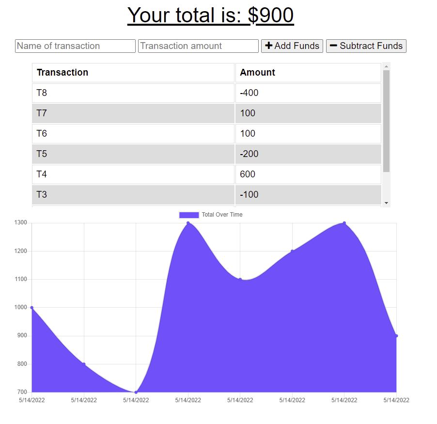

  # Budget Tracker
  ## Project Description
  A simple progressive web application in the form of a budget tracker which allows for offline access and functionality. The user is able to add expenses and deposits to their budget with or without network connectivity. Upon reestablishment of network connectivity, a window alert informs the user the stored transactions have been sent to the MongoDB database successfully. Incorporates technologies/APIs like IndexedDB, MongoDB, Express.js, Cache API, Service Workers, and Heroku. 
  ## Table of Contents
  * [Installation](#installation)
  * [Usage](#usage)
  * [License](#license)
  * [Questions?](#questions)
  ## Installation
  Navigate to https://jlcomp-03-wk19-budget-tracker.herokuapp.com/ to test out the deployed app.
    
  ## Usage
  
  ## License
  
Copyright 2022

    
=======================================
 
    

    
Click for the legal stuff, if that's <em><strong>your thing</strong></em>

    Copyright <YEAR> James Compagnoni

Permission is hereby granted, free of charge, to any person obtaining a copy of this software and associated documentation files (the "Software"), to deal in the Software without restriction, including without limitation the rights to use, copy, modify, merge, publish, distribute, sublicense, and/or sell copies of the Software, and to permit persons to whom the Software is furnished to do so, subject to the following conditions:

The above copyright notice and this permission notice shall be included in all copies or substantial portions of the Software.

THE SOFTWARE IS PROVIDED "AS IS", WITHOUT WARRANTY OF ANY KIND, EXPRESS OR IMPLIED, INCLUDING BUT NOT LIMITED TO THE WARRANTIES OF MERCHANTABILITY, FITNESS FOR A PARTICULAR PURPOSE AND NONINFRINGEMENT. IN NO EVENT SHALL THE AUTHORS OR COPYRIGHT HOLDERS BE LIABLE FOR ANY CLAIM, DAMAGES OR OTHER LIABILITY, WHETHER IN AN ACTION OF CONTRACT, TORT OR OTHERWISE, ARISING FROM, OUT OF OR IN CONNECTION WITH THE SOFTWARE OR THE USE OR OTHER DEALINGS IN THE SOFTWARE
    

  Legalese borrowed from <a href="https://opensource.org/licenses/MIT" target="_blank">here</a>.

  ## Questions?
  I enjoy hearing back about my work. You can reach me at jcomp_03@yahoo.com.
  Alternatively, contact me on my GitHub page <a href="https://github.com/jcomp-03">here</a>.
  
